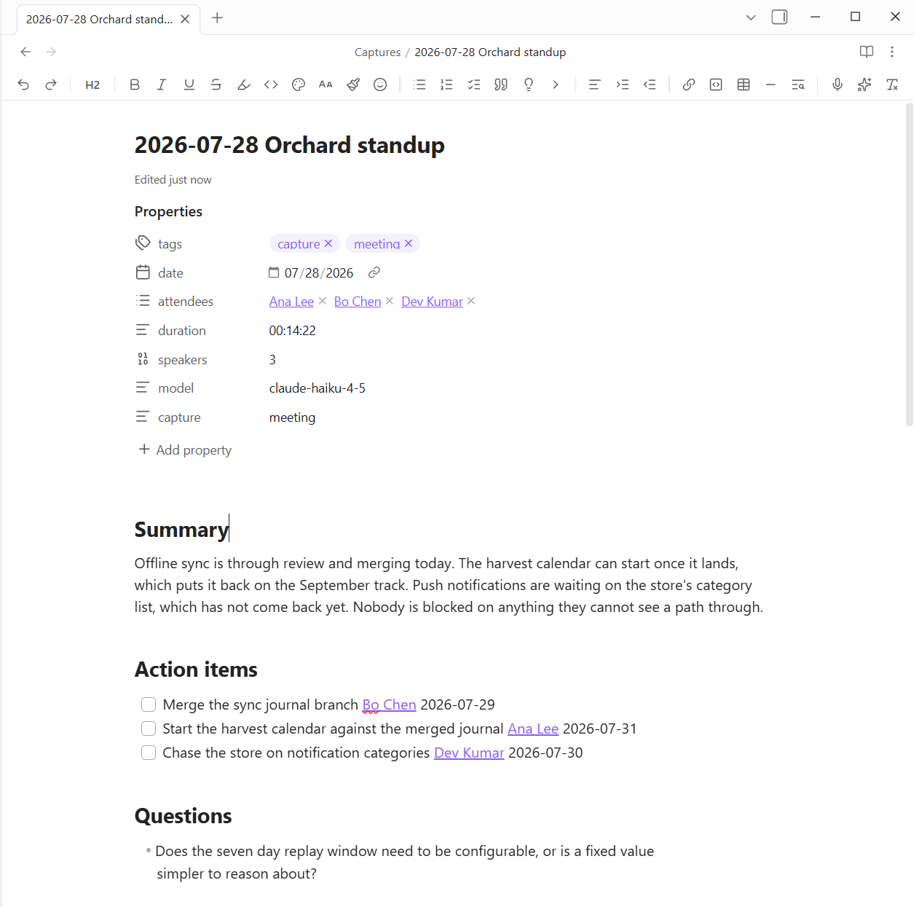
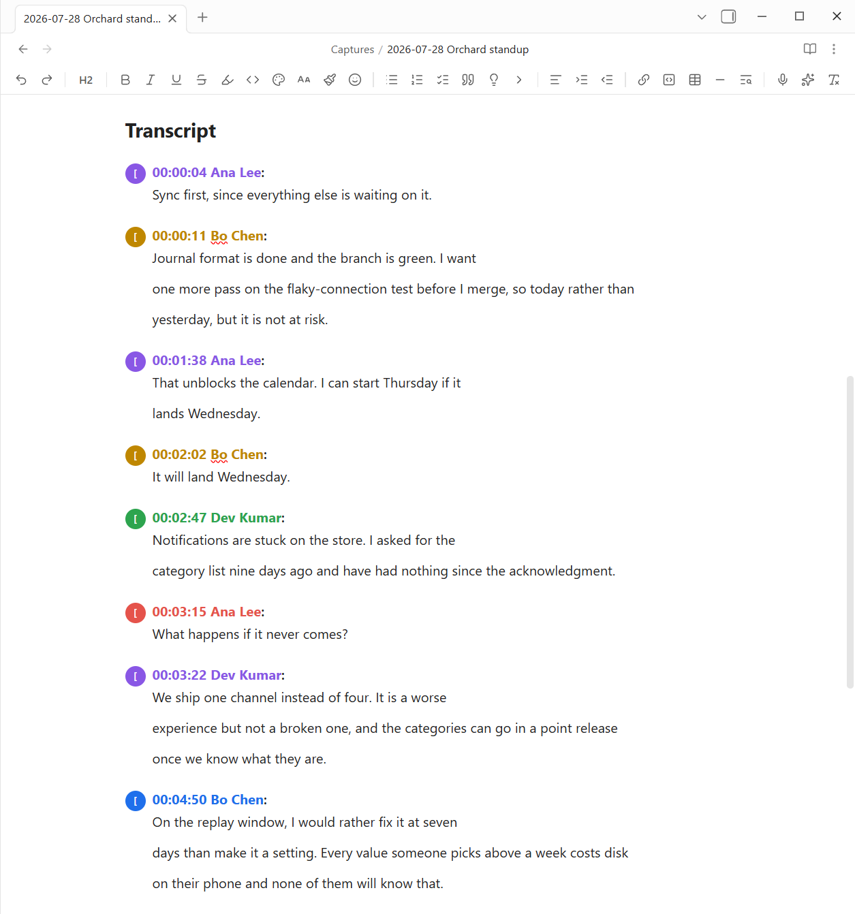

# Power Assistant

Capture meetings, voice memos, and any audio into structured Obsidian notes. Record in the app (desktop and mobile) or drop audio files into a watch folder; Power Assistant transcribes them and uses AI to produce a note with the sections you choose: Summary, Action items (dashboard-ready task lines, or a table), Decisions, Risks & blockers, and Questions. Every note also carries named attendees, clickable timestamps, carried-over items from the previous meeting in the series, the raw transcript, and an embed of the original audio.

One recording in, one note out. The properties carry the attendees, the run time, how many speakers were heard, and which model wrote it. Action items come out as real task lines with an owner and a date, so they roll up in any dashboard that reads tasks.

## Setup

1. **Transcription**: four providers, each with a test button. *Whisper*, any OpenAI-compatible endpoint: Groq (default, fast and cheap), OpenAI, or a self-hosted Whisper server on your LAN; no speaker labels. *AssemblyAI* and *Deepgram* both add **speaker labels** (Speaker A / Speaker B), record a `speakers` count, and let extracted action items attribute who said what; Deepgram starts new accounts with free credit. *WhisperX* is speaker labels **from your own machine**: the server ships inside the plugin, and **Show install steps** in its settings section gives you the one command that sets it up, GPU-matched, with start-at-login (a CUDA box is ideal); meetings then diarize with no cloud provider and no audio leaving your network. **Detect local AI** in the AI model section finds a running Ollama or WhisperX server and fills in the addresses. Rates are not listed here on purpose, since a number baked into a plugin goes stale without anyone noticing: check each provider's own pricing page, and use the built-in AI usage meter for what this vault is actually spending.
2. **Extraction**: pick where the AI runs in the **AI model** section. *Anthropic (cloud)*: paste an API key; `claude-haiku-4-5` (default) is the fast, inexpensive one, and `claude-opus-4-8` the highest quality. *Custom endpoint*: point it at a server speaking the Anthropic Messages API (Ollama 0.14+, LM Studio, or llama.cpp on your own machine or LAN) and every AI feature runs there instead, metered at $0.00. Leave both unset to save transcripts without AI notes. Deciding between models? Copy a few finished capture notes into a folder, add `pa-eval: true` to their frontmatter, and run **Run extraction evals**: the configured model re-extracts each transcript and a report scores it against what the note already has, so the choice is a table, not a feeling.
3. **Microsoft 365 calendar (optional)**: to import meetings straight from Outlook/Teams, connect your account once (see below). Not needed for pasting invites or `.ics` files, which work with no setup.

## Connect Microsoft 365 (calendar import and emailing a page)

This is optional, and covers two features: the *Import meeting from calendar* command and *Email this page*. It uses your own free Azure app registration, so nothing is shared with a third party and your password never touches the plugin (sign-in happens in your browser).

**Fastest way, if you have the [Azure CLI](https://aka.ms/installazurecli):** run [`tools/entra-app-setup.ps1`](tools/entra-app-setup.ps1) in PowerShell. It does steps 1 to 4 below in one pass, checks whether your organization needs an administrator to approve anything, and prints the two ids to paste into settings. Pass `-DryRun` first to see what it will do. Then do step 5. The manual steps follow for anyone who would rather click through the portal.

1. Go to the [Azure portal](https://portal.azure.com) > **Microsoft Entra ID** > **App registrations** > **New registration**. Name it anything (for example "Power Assistant"), leave the defaults, and register.
2. Open the app's **Authentication** page, and under **Advanced settings** set **Allow public client flows** to **Yes**. Save.
3. Open **API permissions** > **Add a permission** > **Microsoft Graph** > **Delegated permissions** > add **Calendars.Read** (calendar import) and **Mail.Send** (emailing a page). (If your organization requires it, click **Grant admin consent**.)
4. Copy two values from the app's Overview page into Power Assistant settings under **Microsoft 365 calendar**: the **Application (client) ID**, and the **Directory (tenant) ID** into the **Tenant** field. (The registration default is "My organization only", which requires the tenant ID; `common` only works if you registered the app as multi-tenant.)
5. Click **Connect**, open the sign-in page it shows, enter the code, and approve. Then run *Import meeting from calendar*.

Sign-in tokens are stored locally in this vault's plugin data. Use **Disconnect** to remove them.

Already connected from before **Email this page** existed? That connection agreed to the calendar permission only, so the next time the plugin refreshes it you will be asked to **Connect** once more. Nothing is lost; the new sign-in simply covers both.

## Use

- Click the **mic ribbon icon** (or run *Start / stop recording*) to record; the icon pulses while recording. Stopping saves the audio into the capture folder, or into a dedicated recordings folder if you set one (see **Folder for recordings** in settings).
- While recording, a **recording panel** opens in the sidebar with a running timer and a live input-level meter, so you can always see that capture is working. On desktop with AssemblyAI it also streams the live transcript; on other providers the full transcript appears after you stop. Toggle it with the **Recording panel** setting.
- **Prep a meeting, then record into it.** Click the **calendar ribbon icon** (or run *New meeting note*) to open a dialog for a title, attendees, agenda, and meeting type. It creates a dated note in your meetings folder; choose *Create and record* and the recording folds into that same page, with the AI summary, action items, and transcript landing below your agenda. Already have a meeting note open? Run *Record a meeting into this note*. Set the destination and name pattern with **Meetings folder** and **Meeting filename** in settings.
- **Prefill from an Outlook / Teams invite.** In the New meeting dialog: paste an invite into the **Paste from Outlook** box, click **From clipboard**, or click **Load .ics file** and pick a saved invite. It fills the title, date, attendees, location, agenda, and the Teams join link, meeting ID, and passcode. For a complete result including attendees, use **File > Save As > iCalendar** in Outlook and load that `.ics` (attendees live in the invite's header, so copying just the meeting body won't include them). Even a plain body paste fills the agenda and Teams link.
- **Import from your Microsoft 365 calendar.** After a one-time connect (see below), run *Import meeting from calendar* to list your next two weeks of meetings and pick which ones become notes. Each one lands prefilled and ready to record into. The New meeting dialog also has a **From calendar…** button that picks a single upcoming meeting and fills the open dialog, no paste needed.
- On desktop the recorder also captures **system audio** (what plays through your speakers/headset), so both sides of a Teams/Zoom/Meet call land in the recording. The start notice says whether it's "mic + system audio" or "mic only". Toggle in settings.
- **Drop any audio file** (webm, m4a, mp3, wav, ogg, flac, mp4) into the capture folder: Zoom local recordings, phone voice memos, exported meeting audio.
- **Right-click any audio file** (or run *Process the active audio file…*) for the per-file processor: pick exactly which sections to extract and where the note goes for that one run.
- Run **Capture a YouTube video…** with a URL to fetch its caption track and produce the same structured note: no extra API needed.
- **Capture from a link…** takes any URL and works out how to read it. A YouTube link uses its free captions; a video or social post is downloaded and transcribed; anything else is read as a web page. The dialog tells you which it picked, and **Read it as** overrides it for a blog that is really a video page, or a video site it does not recognize.
  - **Video and social**: X, TikTok, Instagram, Facebook, Reddit, LinkedIn, Bluesky, Vimeo, Twitch, Rumble, Dailymotion, and SoundCloud by name, plus roughly 1,750 more via **Read it as > Video**. These have no captions, so playable media needs a transcription key and the `yt-dlp` program (`pip install yt-dlp`). An X post that is only words needs neither: its text is read from X's own embed endpoint, which also carries the post it quotes or replies to, so a quote-post is captured as the exchange instead of as an orphaned line. (The replies underneath are not captured: X serves those only to a logged-in client, so the note keeps the reply count and not the reply text.) A post with nothing to play elsewhere falls back to the page reader. Instagram, Facebook, and LinkedIn also need the **Cookies from browser** setting, since they show a logged-out visitor almost nothing.
  - **Web pages**: fetched, reduced to the article, converted to Markdown, and extracted into the usual sections, with the full text kept under an **Article** heading. No audio and no `yt-dlp`, so a page costs no transcription at all.
  - **MSN** builds its pages in the browser, so there is no article in the page a fetch gets back. Its links are read through MSN's own content service instead. MSN carries other outlets' reporting, so the note credits the publisher that wrote the piece and links their original article rather than the MSN feed link, which means `Reading/{{site}}` files it under `Newsweek` and not `MSN`.
  - Folder and filename patterns take a `{{site}}` token, so `Social/{{site}}` and `Reading/{{site}}` file captures by source.
- On a phone, turn **Process on this device** off: record there, and your desktop processes the file when it syncs over.
- **Ask your vault** (sparkles ribbon icon or the command): type a question like "what did we decide about the Q3 roadmap?" and get a cited answer with links into the source notes. Retrieval is a local full-text index over your configured folders (default: the capture folder). Claude expands your question into search terms and answers only from the matching excerpts, so nothing is invented and every claim links to its note. Index updates automatically as notes change; "Rebuild the Ask index" forces a full rescan.
- **With Power Explorer installed**, Ask retrieves through Power Explorer's vault-wide search index instead: one shared index covering the whole vault, including PDF pages and OCR'd screenshots, and Power Explorer's search modal gains an **Ask AI** chip that runs this same pipeline. Power Assistant's own index remains the fallback, so Ask works standalone too.
- **Timestamps**: AssemblyAI transcripts are speaker-labeled AND timestamped (`**Speaker A [12:34]:** …`), so long meetings are scannable and audio-jump has anchors to land on.

## Meeting intelligence

Each speaker keeps one color across the whole transcript, so a turn is attributable at a
glance without reading the name. The stamp beside it seeks the audio, clicking a name
opens the rename dialog, and **Highlights only** in the header filters to the turns worth
rereading.

- **Click a stamp, hear the moment.** In Reading view, every `[12:34]` stamp in a capture note is a link: clicking it seeks the embedded audio to that second and plays. Works in the transcript, in Moments, anywhere in the note.
- **Real names, not Speaker A.** After a diarized transcription, Claude reads the words for self-introductions and addressing patterns, proposes who each speaker is, and a small dialog lets you confirm or fix the guesses (an empty box keeps the letter). Named attendees become wiki-links in the note's properties, and the transcript labels are rewritten. Nothing is ever guessed from outside the transcript.
- **Voice identity (opt-in).** With WhisperX transcribing, name a speaker once and the voice itself is remembered: the next recording arrives with that letter already suggesting the name (voice suggestions outrank the text guesses, and Claude is only asked about letters the voices could not answer). It also audits every cluster turn by turn, so a long meeting's "Speaker 2" that is secretly two people is split apart before the note is written, rotated recordings share one speaker space instead of per-part 1A/2B seats, and a calendar-imported meeting's attendee count caps how many speakers the diarizer may invent. Suggestions, never assertions: enrollment happens only when you name a letter, gated on a few seconds of clear speech.
- **Crosstalk is labeled, not misfiled.** When two or more people genuinely talk at once (a clean handover does not count), that turn is labeled **Crosstalk (Steve + Speaker B)** instead of being silently credited to whichever voice dominated, with a muted badge showing the voice count. The words themselves are still the dominant voice's, since transcription follows the strongest signal and an interjection under it is usually lost; the label is honest about who else was audible, and the timestamp still plays the moment so you can hear it yourself. Renaming a speaker updates crosstalk labels too, and a voice heard only in overlap still gets a letter, so it can be named and recognized. WhisperX transcriptions only.
- **Action items that are actually tasks.** With "Action items as tasks" on (the default), extraction emits `- [ ] Task [[Owner]] 📅 2026-07-18` checklist lines in the Tasks format: they show up in todo dashboards with a backlink to the meeting, owners link to people notes, and relative deadlines ("by next Friday") resolve against the meeting date. The owner link and due token appear only when the transcript actually states them.
- **Recurring meetings know their history.** When a capture's name matches an earlier one (dates and counters ignored), the extractor sees last time's decisions and open items as context, and the note gets a **Carried over** section listing anything still open, each item linking back to its meeting. Carried items are deliberately not checkboxes, so dashboards never count a task twice.
- **Templates.** The per-file processor has a template dropdown (General, 1:1, Leadership, Customer call) that presets which sections to extract; every toggle stays editable per run.
- **Talk shares and keywords.** Every multi-speaker note opens with a **Speakers:** line showing who did the talking ("Steve (57%), Rachel (26%)"), the naming dialog sorts by it (busiest first, with each speaker's first words shown), and a Keywords section gives each meeting a one-line topic fingerprint that vault search picks up.
- **Retroactive speaker tagging.** Click an unnamed **Speaker X** label in Reading view (or run *Rename speakers in this capture…*) to retag any existing note: transcript labels, the Speakers line, and attendees all update in place, with type-ahead suggestions drawn from attendees across your captures.
- **Ask about this meeting.** Right-click a capture note (or run the command) for a chat scoped to that one meeting: starter chips ("What decisions were made?", "Was I mentioned?" once your name is set in settings, "What did X commit to?" per attendee), real multi-turn follow-ups, and answers that cite the note's clickable [m:ss] stamps.
- **Redaction for sharing.** Turn on redaction in settings (or use the one-off *Copy redacted summary* command) to mask emails, phone numbers, SSNs, card numbers, custom terms, and optionally attendee names when you copy a summary or export to Word. It never touches the note itself, only the shared/exported copy.
- **Custom templates.** Beyond the built-in meeting types, define your own named section presets in settings; they show up in the Process and Re-extract dialogs.
- **Audio retention.** Choose to keep recordings (embedded in the note) or move them to trash once the note is written. The transcript is the durable record, so trashing frees space and tightens privacy.
- **Pause / resume.** Pause the recording mid-meeting and resume; the saved audio has no gap and timestamps stay aligned.
- **Folder for recordings.** Recordings save into the capture folder by default. Point them at a dedicated folder (for example `_resources/audio`) to keep audio out of your notes area. The folder is created on demand, existing recordings are left where they are, and both auto-processing and audio cleanup look in the capture folder and the recordings folder.
- **Export as a Word document.** Right-click a capture note (or run the command) to write a clean, formatted `.docx` recap into an Exports folder: a title block with attendees and the long date, each section as a styled heading, and action items as an Owner / Task / Deadline table. The same document shape the AI-notetaker tools export, produced entirely locally from your note.
- **Live transcript and Mark moment.** Desktop with AssemblyAI: while recording, a sidebar pane shows the conversation as it happens. Press the pane's button (or run *Mark this moment*) to drop a timestamped bookmark; marks land in the note's **Moments** section as clickable stamps. The live leg is strictly best-effort: if it fails, the recording and the batch transcription are untouched.
- **Crash-safe, size-safe recording.** Every second of audio is also appended to a hidden partial file on disk, so an Electron crash mid-meeting loses nothing: the next launch recovers it as a processable recording. Long sessions rotate into parts (45 minutes by default, configurable) so provider file-size limits never truncate a meeting; parts are transcribed together, time-shifted, and produce one note embedding all the audio.

## The assistant

- **Semantic search (opt-in).** Set an **Embeddings endpoint** (local Ollama keeps everything on your machine, or any OpenAI-compatible provider) and Ask and the chat blend keyword search with meaning, so a note surfaces even when you do not recall its exact words. Off by default; keyword search needs no setup.
- **Sidebar chat.** Click the sparkles ribbon icon (or run *Open assistant chat*) for a running conversation grounded in your vault: every question retrieves the matching notes and answers with clickable citations, and short follow-ups keep the thread's subject. The conversation survives closing the panel and reloading. **Save summary** writes the conversation up as a note in a Chats folder, full exchange folded underneath, so good conversations become part of the vault they were about.
- **Document intelligence.** Right-click an image or PDF and choose *Process document* (or drop it into a watched inbox folder): the text is read (Text Extractor OCRs images; PDFs need nothing extra), the vendor, date, amount, and type are extracted, the file is renamed and filed under `Documents/<Type>/<year>/`, and a note with those values as properties lands beside it. Bills, receipts, and statements become queryable from Power Bases and findable through search and the chat. **Filing rules** (in settings) can route and tag documents your own way by vendor, type, amount, or text.
- **Morning briefing.** The sunrise ribbon icon (or *Morning briefing*) opens a start-of-day note: today's meetings (from your Microsoft 365 calendar when connected, with join links), commitments overdue or coming due, bills and documents due soon, and recent open questions. Opt in to **Auto morning briefing** and it opens itself once a day.
- **Draft from context.** *Draft from this meeting* (right-click a meeting note or run the command) writes a follow-up email, status update, chat recap, or thank-you note grounded in that meeting's decisions and action items, in the tone you pick; copy it or insert it into the note. *Draft from recent meetings* drafts from the whole week.
- **Email any page.** *Email this page* (right-click any note, or the command) sends it from your own Microsoft 365 mailbox, as the whole page or as a summary of it, with a line of your own on top. A note is written for the vault it lives in, so what leaves is flattened for someone who does not have it: wikilinks become their own words, embeds and block ids go, callouts keep their title and quote. Your `%%comments%%` and the note's frontmatter never leave, by design. You see the mail rendered as they will read it before **Send** does anything, and it files in your Sent Items like anything else you send. Needs the Microsoft 365 connection below; a summary also uses the Anthropic key.
- **Finances rollup.** *Finances rollup* turns your processed bills and receipts into an overview note (totals per currency, upcoming and overdue bills, spending by vendor and month), and *Create the Finances base* builds a filterable, summable table and due-date calendar over the same documents. With Power Bases installed you get its richer table plus the calendar and per-type colors; without it, the file is written for Obsidian's own Bases as a plain table.
- **MCP bridge.** A standalone MCP server in [`mcp/`](mcp/) exposes your vault (search, read, recent notes, finances) to Claude Desktop and Claude Code, so you can ask about your meetings and bills from outside Obsidian, whether or not it is open. See `mcp/README.md` to connect it.

## Meeting memory

- **Import your existing archive.** *Import a transcript file…* takes Otter .txt exports and Teams/Zoom .vtt/.srt files (pick from anywhere on disk, or right-click one inside the vault) and produces the same first-class note as a recording: named speakers straight from the file, true timestamps, task-format actions, series linking, keywords, talk shares. No transcription key needed, so months of history import for the cost of extraction alone.
- **Person reports and 1:1 prep.** *Person report…* builds a hub for any attendee: open commitments across every meeting (referencing their source notes, never duplicating tasks), decisions involving them, and their meeting history. *Prep for a 1:1…* adds a Claude-drafted agenda grounded only in their open items. Generated notes are marked `generated: true` and refresh in place; your own notes are never overwritten.
- **A People folder.** Attendee names in note properties are links into a People folder (configurable; defaults to People under the output folder). Clicking a name opens that person's page, and its backlinks list every meeting they attended. Person reports are written to the same folder, so the link and the hub are the same page. Clicking someone who has no page yet builds their hub on the spot: the blank note Obsidian creates is moved into the People folder and filled with their person report automatically (this also catches clicks from notes made before the People folder existed). Generated person pages refresh themselves when meeting notes are created, edited, renamed, or deleted; remove a page's `generated` property to take ownership and stop refreshes.
- **Weekly digest with aging.** *Weekly meeting digest* rolls the last seven days into one note: an executive summary, decisions, a commitments-by-owner table with Power Tables column sums, and a "going stale" table where anything open past two weeks ages in red.
- **A Meetings base.** *Create the Meetings base* drops a ready-made base file next to your notes: sortable table and calendar views over every capture, colored by series. Power Bases renders the calendar and the series colors; without it, the file still opens in Obsidian's own Bases as a plain table.
- **Re-extract any capture.** *Re-extract this capture…* re-runs extraction from a note's own transcript with a new template or model: no re-transcription, and the transcript, moments, and embeds stay untouched.
- **Live copilot.** While recording, the live pane's **Catch me up** button summarizes the last ten minutes on demand, and a debounced detector lists commitments as they're spoken (display only, the batch extraction still writes the note's tasks).
- **Cost you can see.** Every processed note records an order-of-magnitude cost estimate in its properties ("≈$0.04 (12 min audio, 18k tokens)").
- **Scoped asking.** Ask your vault gains attendee and time-range filters, so "what did we decide" can mean "with Rachel, in the last 30 days".

## Commands

Every feature is a command (bind hotkeys to the ones you use most). Commands marked ● act on the active capture note.

| Command | What it does |
| --- | --- |
| Start / stop recording | Record mic (+ system audio on desktop); rotates and is crash-safe |
| Pause / resume recording | Pause and resume the in-progress recording |
| New meeting note… | Create a dated meeting note (title, attendees, agenda), prefill from an invite, then optionally record straight into it |
| ● Record a meeting into this note | Record now and fold the summary and transcript into the open meeting note |
| Import meeting from calendar (Microsoft 365)… | Pick from your upcoming calendar meetings; each becomes a prefilled note |
| Process the active audio file… | Per-file processor: pick sections, template, and destination |
| Import a transcript file (Otter, Teams, Zoom)… | Turn an existing transcript export into a capture note |
| Capture a YouTube video… | Fetch a video's captions into a structured note |
| Capture from a link… | Any URL: routes to captions, transcription, or an article |
| Capture an X post… | Transcribe an X post's video into a structured note |
| Capture a web page… | Read a page's article into a structured note |
| Mark this moment (while recording) | Drop a timestamped bookmark into the note's Moments |
| ● Ask about this meeting… | Chat scoped to one capture, with starter questions |
| ● Rename speakers in this capture… | Retag speakers; updates transcript, Speakers line, attendees |
| ● Re-extract this capture… | Re-run extraction from the transcript, new template or model |
| ● Copy summary to clipboard | Distill the note for Teams/email |
| ● Copy redacted summary to clipboard | Same, with sensitive info masked |
| ● Export as Word document (.docx) | A formatted Word recap: title, attendees, sections, action-item table |
| Email this page… | Send any note from your M365 mailbox, whole or summarized |
| Person report… | A hub of someone's commitments, decisions, and meetings |
| Prep for a 1:1… | A person report topped with a drafted agenda |
| Weekly meeting digest | This week's decisions, commitments by owner, and stale items |
| Create the Meetings base | A table + calendar over every capture (calendar needs Power Bases) |
| Ask your vault… | Cited answers across your notes, with attendee/date filters |
| Rebuild the Ask index | Force a full rescan of the indexed folders |

## Last edited, on the page

A quiet **"Edited 3 minutes ago"** line on the note itself. Obsidian already tracks every file's modified time; this is the part it never shows you. Off by default: turn it on under **Notes** in settings.

- **Where**: under the note's title, under the title with a hairline drawn between the two so the pair reads as one page header, at the very end of the note, or both.
- **Format**: relative (`3 minutes ago`), the exact date and time, or relative followed by the exact date. Click the stamp to see both for that note whatever the setting is, and hover for the exact time either way.
- Wording stays coarse on purpose (*just now, an hour ago, yesterday, 12 days ago*) and switches to a plain date past a month, because "37 days ago" is harder to place than "Jun 18". It re-times itself every minute.
- It reads the file's own modified time, so it is right with nothing to maintain. **In a synced vault that is not always true**: a sync client rewrites the modified time when a note arrives from another device, which would make it look freshly edited here. So a note's own `updated:` (or `modified:`, or `last-edited:`) frontmatter property wins where it exists.

**Power Editor draws this line too, and owns it wherever it is installed**, so the two never stamp the same title twice. With both plugins in a vault, change it in Power Editor's settings; this copy takes over again if Power Editor is ever removed.

## Privacy & network use

Power Assistant talks to external services **only when you use the matching feature**, always with your own API keys (stored locally in the plugin's settings file inside your vault). There is no telemetry, no analytics, and nothing runs in the background beyond the folder watchers you configure.

- **Transcription**: audio you record or drop into the capture folder is uploaded to the provider you configured, a Whisper endpoint (Groq, OpenAI, or a self-hosted/LAN server), AssemblyAI, Deepgram, or your own WhisperX server, and the transcript comes back. Point a Whisper endpoint or WhisperX at a LAN server and audio never leaves your network. No key set means no upload.
- **AI extraction, speaker naming, drafting, Ask, and the assistant chat**: transcripts, note excerpts, your questions, and (for drafting) meeting content are sent to the AI model you configured, the Anthropic API, or your own Anthropic-compatible endpoint (Ollama, LM Studio, llama.cpp), in which case nothing goes to Anthropic. With neither set, no AI calls happen; you still get transcripts.
- **Voice identity** (optional, off by default): a voiceprint is biometric data, which is why this is a deliberate opt-in. With it on, voice vectors are computed by your own WhisperX server (never a cloud provider), the library is a plain vault file you can open (`_resources/voiceprints.json` unless you point it elsewhere), and it syncs only where your vault syncs. Forget, per person in settings, truly deletes a print; deleting the file deletes them all. You are fingerprinting other people's voices: check what consent your workplace or jurisdiction expects before enrolling colleagues or customers.
- **Live transcript** (optional): with it enabled, audio streams to AssemblyAI in real time over a temporary token. Off by default.
- **Microsoft 365** (optional): connecting uses the device-code flow in your browser against your own Azure app; afterwards *Import meeting from calendar* reads your calendar over Microsoft Graph. Tokens are stored locally in the vault; your password never touches the plugin.
- **Email this page** (optional): the only feature here that sends anything to another person. Nothing goes anywhere until you fill in a recipient and click **Send**, and the mail is shown to you first, as they will read it. It then goes out over Microsoft Graph from your own mailbox, addressed by you, and files in your Sent Items. What leaves is the page flattened for someone outside the vault; your `%%comments%%` and the note's frontmatter are removed before it is built, not after. Choosing **A summary of it** sends the page's text to Anthropic first, like any other extraction.
- **Semantic search** (optional, off by default): with an embeddings endpoint set, your indexed notes and each search query are sent to that endpoint to be embedded. Point it at local Ollama and nothing leaves your machine.
- **YouTube capture** (optional): fetches the video's caption track and metadata from YouTube. With **Transcribe the audio** turned on, it also downloads the video's audio and sends it to your transcription provider (as above) for a more accurate transcript.
- **Video and social capture** (optional, desktop only): runs `yt-dlp`, a separate program you install yourself, to read the post's metadata and download its audio, which is then sent to your transcription provider (as above). There is no caption track to fall back on, so a capture always transcribes. The audio is downloaded to a temporary file outside the vault, copied in only for the transcription call, and deleted from both afterwards.
- **Cookies from browser** (optional, off by default): off, nothing reads your browser. Set it to a browser and `yt-dlp` reads that browser's cookie store at download time, so sites that require a login (Instagram, Facebook, LinkedIn) see you as signed in. The cookies are read per run and used only for the site being captured; none are copied into the vault or into the plugin's settings.
- **Web page capture** (optional): fetches the page you paste and reduces it to its article locally, using Mozilla's Readability. The page's text goes to Anthropic only if you have an extraction key set, exactly like a transcript. The article is stored in your own vault for your own reading; treat what you capture the way you would any clipping, and mind the source's terms.
- **Document processing**: OCR runs locally through the Text Extractor plugin, and PDF text is read locally; the extracted text is then sent to Anthropic for field extraction, like any other note.
- **The MCP server** (`mcp/`, optional): a separate local, read-only process you run yourself; it makes no network calls.

Paid third-party keys are optional end to end: self-host WhisperX for speaker-labeled transcription, point the AI model at your own Ollama (or LM Studio / llama.cpp) endpoint for extraction and chat, and use local Ollama embeddings for search, the whole pipeline then runs on machines you own. Device roles complete the picture: set a phone or laptop to *Record only* and a home machine to *Processor*, and recordings queue through your synced vault to be transcribed where the hardware is.

## The MCP bridge

A standalone Model Context Protocol server in [`mcp/`](mcp/) exposes this vault to Claude Desktop and Claude Code. See `mcp/README.md` to connect it.

## Support

Power Assistant is built and maintained by one person. If it earns a place in your
daily vault, you can [buy me a coffee](https://buymeacoffee.com/powerplugins).
Nothing in the plugin is held back either way.
